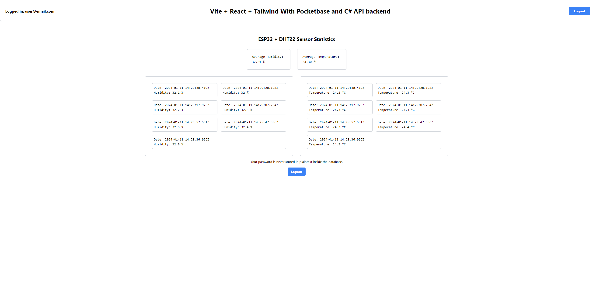
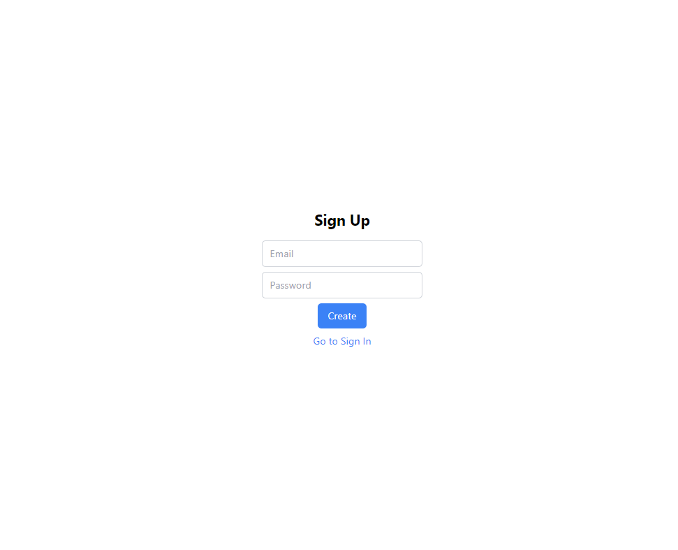

# 💻 ViteReactTailwind + 🔧 C# SerialAPIserver + Pocketbase + 🔌 ESP32/DHT22

## 🚀 Features & Build

A hobby project combining many different technologies together with Docker🐋. This project stores and displays real time temperature 🌡️ and humidity ☁️ data gathered from DHT22 sensor. ESP32 Then sends the data via a serial USB connection to the C# server which forwards the information to Pocketbase. Pocketbase provides backend functionality: authentication 🔐, real time data subscriptions ⏳ and of course the database. This is then fetched by the React frontend and shown to the user in real time.


🎨 **Frontend:**

Vite + React + Tailwind
 - Frontend
 - Displaying data in real-time
 - Authentication
  - Sign up & Login 
 - password hashing

📦 **Backend/Database:**

Pocketbase:
 - Authentication
 - Admin dashboard
 - Real time data subscriptions

🖥️ **API server / Serial Reader:**

C# server
 - Sends the ESP32/DTH22 data to the database
 - [ESP32 used](https://docs.espressif.com/projects/esp-idf/en/latest/esp32s2/hw-reference/esp32s2/user-guide-devkitm-1-v1.html)
 - [DHT22 used](https://www.switchelectronics.co.uk/products/dht22-digital-temperature-and-humidity-sensor-module)
### 🌟 Features ###

- Password Hashing
- Real time data fetching
- RLS policies
- Easu setup via Docker compose

## 🛠️ Setup & Usage

Can be easily launched via docker compose, but first:

**🔌 ESP32:**

- Connect cords accordingly:
  - ESP32 Pin 14 -> DHT22 DAT
  - ESP32 GND -> DHT22 GND
  - ESP32 3v3 -> DHT22 VCC
- Flash the ESP32andDHT22 arduino file:
  - [Guide](https://www.instructables.com/How-to-use-DHT-22-sensor-Arduino-Tutorial/) Do not follow directly: Change the library and the code
- Connect to your computer via USB.

**🐋 Docker-compose USB:**

- Find out the USB with this command: ' ls -l /dev/serial/by-id ' 

    -> It will return something like this: "usb-Silicon_Labs_CP2102_USB_to_UART_Bridge_Controller_0001-if00-port0 -> ../../ttyUSB0"

    Now change the docker-compose file accordinly:

    ```
    devices: # Change USB
        - "/dev/ttyUSB0:/dev/ttyUSB0" <-- Only the left side
    ``` 


**🛣️ Routes:**

- Pocketbase Admin Panel: http://localhost:8090/_/

- React Frontend: http://localhost:8090

## Tailwind UI ##






## 📝 Notes

Not secure by default!

- See RLS policies from the pocketbase UI

  Current setup:

  - Anyone can list, read, and create DHT22 collection entries

  - Anyone can create an account and see Temperature entries

    These are very easily changed via the UI RLS policies.

- Delete default users:

  - Done easily via the Pocketbase admin panel.

- Stores data indefinitely

- The temperature/humidity post interval is 10s by default. Can be changed from the C# backend (Program.cs).
